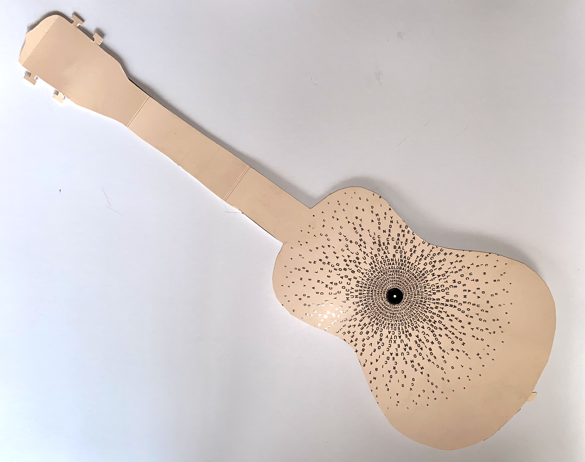
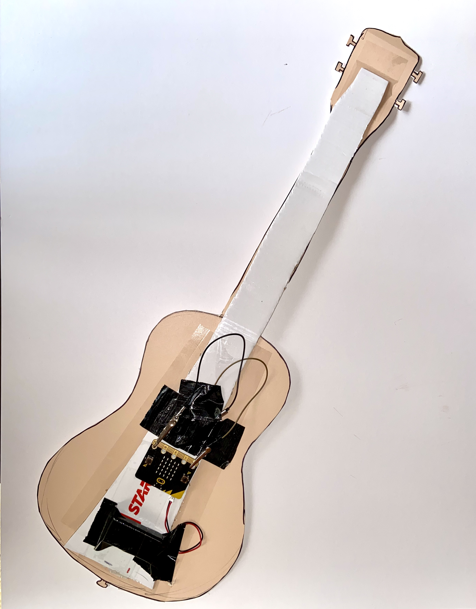

# Assessment 1: Replication project

## Replication project choice ##
Guitar

## Related projects ##

### Related project 1 ###
Midi Keypad

https://create.arduino.cc/projecthub/labsud/midi-keypad-c68fd2?ref=tag&ref_id=guitar&offset=5

This project is related to mine because it shares the same type of music components. Using technology and Ardiuno/microbit's to link traditional music and intruments into technological inputs.

### Related Project 2 ###
Midi Wood Keyboard

https://create.arduino.cc/projecthub/BERRU/midi-wood-keyboard-88053e?ref=tag&ref_id=music&offset=2

This second project is related in a similar way to the first. Although there are more similarities in this when comparing mine with the Keyboard. The rustic elements that go into the construction on the instruments, the cardboard in mine and the wood of the keyboard.

### Related Project 3 ###
Arduino Air Guitar

https://www.instructables.com/id/How-to-build-an-Air-Guitar-with-Arduino-aka-the-A/

The air guitar project looks very interesting and when comparing with my replication project there are a few similarities. FOr instance my guitar use montion sensor on board the micro kit to sence tilting of guitar and as a reaction plays the inidividual beats faster or slower. The Air guitar uses an accelerometer to trigger sound. The use of the technology to make some sort of music is very interesting.

## Interaction flowchart ##

## Process documentation

The process started on a lovely Sunday afternoon, I chose to do the Guitar replication project. First off i recieved a box of makeup from Mecca Cosmetics, I looked at the box and thought *hmmmm this is a good looking box*. I then traced my ukelele on the back of the box, with doing this I tried to keep the design of the box centred on the "Guitar". The design is always a big component for me. After the designing I then got more thicker cardboard to strengthen the structure of the skeleton of the guitar. 

After this the long slog of code, oooohhhh the test and error and test and error... 
The code was fairly easy, and once it got to the music part of coding, it was very fun and frustrating at the same time.
As I tested and failed, with different sections of the code,  the end product ended up being much simpler then the actual project i was replicating. Which sucks but its what i rolled with.

## Project outcome ##

### Project title ###

Allstar Guitar

### Project description ###

The allstar guitar project can be for anyone, anyone who is intrested in giving it a chance. It would be used for fun to play around and have a laugh with. This project is to be enjoyed.

### Showcase image ###

### Additional view ###

https://youtu.be/uFeS8oqGr18

### Reflection ###

Allstar Guitar I felt like the design and intial stages of coding went quite well. I particularly enjoyed coding the the tones to come out as Allstar by Smashmouth. I used a piano tutorial to help me transfer what chords would work in a string to make the first verse. I played around with beat times and rests, this part was one of my favourite parts of the assessment. 
During the design aswell, cuting out the shape was horrifiying difficult. But building and connecting all the bits and the wirnig together and crappily mounting it on the back of the guitar was fun and quite rewarding when I finally got it to work. It's weaker points came in the final parts of coding, for example the on/off button that is in the main project. I couldn't get that to work along with the rest of the project, so I ended up cutting it out.

I found that using the MicroBit tutorial was my main help, looking at the code that they used felt like cheating a bit , even though its part of the project. Afterwards trial and error was the main approach I took with seeing if the code would work inreality and not just in the microbit's simulator. My code ended up being a very long and tedious ordeal looking nothing like what I expected it to. 

An interesting extention to the project could be the adding things like athe little waver toggle electric guitars have. Using some sort of toggle, a little gaming joystick perhaps,  to add another interesting element to the project.
