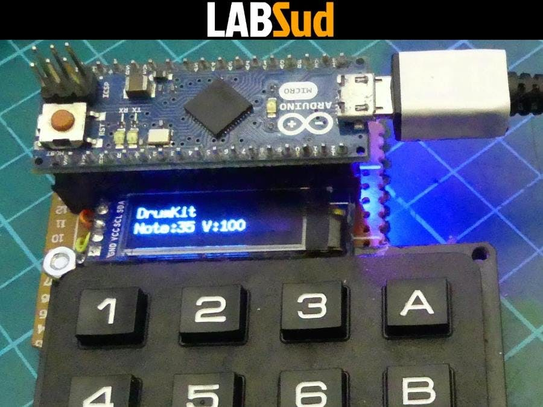
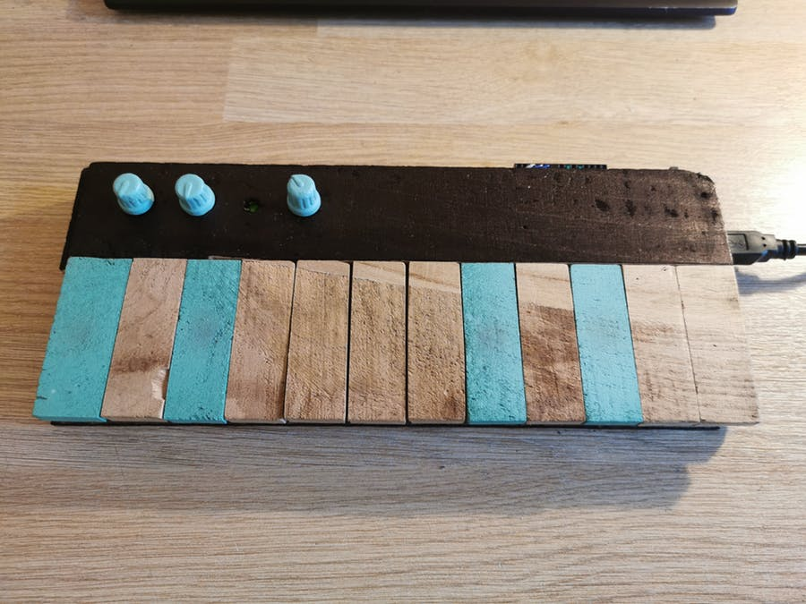
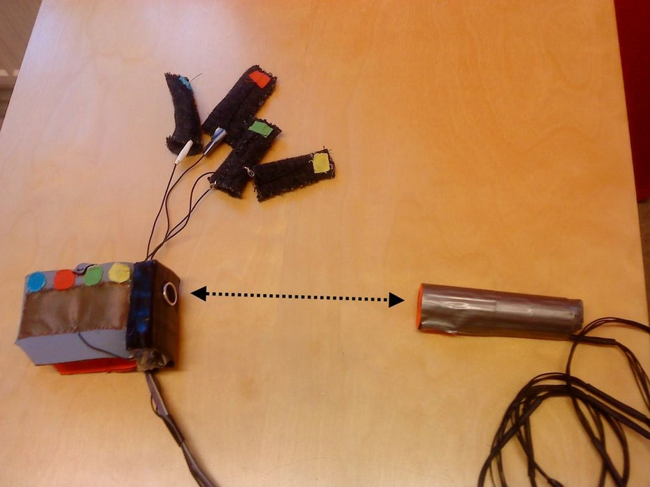

# Assessment 1: Replication project

*Markdown reference:* [https://guides.github.com/features/mastering-markdown/](http://guides.github.com/features/mastering-markdown/)

## Replication project choice ##
Guitar

## Related projects ##
*Find about 6 related projects to the project you choose. A project might be related through  function, technology, materials, fabrication, concept, or code. Don't forget to place an image of the related project in the* `replicationproject` *folder and insert the filename in the appropriate places below. Copy the markdown block of code below for each project you are showing, updating the number* `1` *in the subtitle for each.*

### Related project 1 ###
Midi Keypad

https://create.arduino.cc/projecthub/labsud/midi-keypad-c68fd2?ref=tag&ref_id=guitar&offset=5

This project is related to mine because it shares the same type of music components. Using technology and Ardiuno/microbit's to link traditional music and intruments into technological inputs.

### Related Project 2 ###
Midi Wood Keyboard

https://create.arduino.cc/projecthub/BERRU/midi-wood-keyboard-88053e?ref=tag&ref_id=music&offset=2

This second project is related in a similar way to the first. Although there are more similarities in this when comparing mine with the Keyboard. The rustic elements that go into the construction on the instruments, the cardboard in mine and the wood of the keyboard.

### Related Project 3 ###
Arduino Air Guitar

https://www.instructables.com/id/How-to-build-an-Air-Guitar-with-Arduino-aka-the-A/

The air guitar project looks very interesting and when comparing with my replication project there are a few similarities. FOr instance my guitar use montion sensor on board the micro kit to sence tilting of guitar and as a reaction plays the inidividual beats faster or slower. The Air guitar uses an accelerometer to trigger sound. The use of the technology to make some sort of music is very interesting.

## Reading reflections ##
*Reflective reading is an important part of actually making your reading worthwhile. Don't just read the words to understand what they say: read to see how the ideas in the text fit with and potentially change your existing knowledge and maybe even conceptual frameworks. We assume you can basically figure out what the readings mean, but the more important process is to understand how that changes what you think, particularly in the context of your project.*

*For each of the assigned readings, answer the questions below.*

### Reading: Don Norman, The Design of Everyday Things, Chapter 1 (The Psychopathology of Everyday Things) ###

*What I thought before: Describe something that you thought or believed before you read the source that was challenged by the reading.*

*What I learned: Describe what you now know or believe as a result of the reading. Don't just describe the reading: write about what changed in YOUR knowledge.*

*What I would like to know more about: Describe or write a question about something that you would be interested in knowing more about.*

*How this relates to the project I am working on: Describe the connection between the ideas in the reading and one of your current projects or how ideas in the reading could be used to improve your project.*

### Reading: Chapter 1 of Dan Saffer, Microinteractions: Designing with Details, Chapter 1 ###

*What I thought before: Describe something that you thought or believed before you read the source that was challenged by the reading.*

*What I learned: Describe what you now know or believe as a result of the reading. Don't just describe the reading: write about what changed in YOUR knowledge.*

*What I would like to know more about: Describe or write a question about something that you would be interested in knowing more about.*

*How this relates to the project I am working on: Describe the connection between the ideas in the reading and one of your current projects or how ideas in the reading could be used to improve your project.*

### Reading: Scott Sullivan, Prototyping Interactive Objects ###

*What I thought before: Describe something that you thought or believed before you read the source that was challenged by the reading.*

*What I learned: Describe what you now know or believe as a result of the reading. Don't just describe the reading: write about what changed in YOUR knowledge.*

*What I would like to know more about: Describe or write a question about something that you would be interested in knowing more about.*

*How this relates to the project I am working on: Describe the connection between the ideas in the reading and one of your current projects or how ideas in the reading could be used to improve your project.*

## Interaction flowchart ##

 AppleWebKit/537.36 (KHTML, like Gecko) Chrome/80.0.3987.149 Safari/537.36" etag="qfr2w-nE34kBkHSOXYZD" version="12.9.5" type="github"><diagram id="C5RBs43oDa-KdzZeNtuy" name="Page-1">7Vpre5owFP41fmwfLqL4cba13fXZ5rauH1OIkBmIC/HCfv0SCQImIt1EbbcvSg7HXM573jcnYMe+ila3FMzC98SHuGMZ/qpjX3csq+9a/FMY0sxgu25mCCjyM5NZGMboF5RGQ1rnyIdJxZERghmaVY0eiWPosYoNUEqWVbcJwdVRZyCAimHsAaxa75HPwszqWv3CfgdREOYjm71BdicCubNcSRICnyxLJvumY19RQlh2Fa2uIBaxy+Ny/zq9x++mvds3n5Kf4Ovw7ZcP3y6yzkZP+clmCRTG7LBdS3AXAM9lvORaWZoHkJJ57EPRidGxhyGLML80+eUPyFgqAQdzRriJUBaSgMQAvyNkJv0mJGbSzRRtGPuvBLC8/YiJN81MI4SxHIO3pL/LWwmjZLrBTnSwAUI4Y/AI8RB402A90SuCCeW3YhJD0ZXPk0GupZjcTWEdNoytxCAhc+rBGj9bpjigAazrr5f5ifmV8lQidwtJBBlNuQOFGDC0qCYzkJwINn4F7vxCQq9Pg4vpQxwNBp/vHub2whtH5NN0dJGTtS4P9oeyminaXNDkTCmjtDFpFxxtOAZHwqJukiUoxnzCrIaXInTLEDE4noH1+pdcyauRLXOQL20YYJAkEqg9BHsaBgtIGVzVprS8a3el0OYbS56Ey0KmzVx7w5JEd42WIu8okf9A/poGz0wwD8y4XkM57DeUw7RaXDRmpOzpI0F8WYULmUwSyJTE2Qz454raYGN9AYKqgVe/v5xSUHsKFK8T3h5SISkxTESDcN3iX6ZhKDDRkESP82S/xlZYJjg8AhHCImPvIF5AhjygUWKAURDzhscR4XPQ0pcPieKAt3pF68s6BS66bSq0U1XorqFRaEOj0O4BFFqbRyqUL5FV/b9ky5bYSTS7va39dnsfzVgsf1UAxbcekJbcZsIh2T2Os2Oc0RPnVeRJNoM/lee6/aaUSB/xepXfIE0g/647Bz3PessxtthsHbHe0rLZPQs28zDT9PumkuKNB9G47Dt5+3pVvnudVoA6iAzs3jQb1E52K3JhOceRC6tl+teFdjf9TSUTn0T/Hdxsmhw7OWwOzo3D6mn1ASZK8HgY2FaxtBbBrcPHhB9ptkxKeSSCyisp/EreiJDvr4VAB0lVHNpCxTb3o9LVgGK1BYqpovLM66Tdj2manD5O+2yt+x+McjisU4IxULBYnwUj5FHyiMS2xBBmPM7iTQNdAuqrG0HT82BrcuN0L52K4Jh93cFsoCpOawczUw3sOdVy1slruRMXc3Y1YTbPWg9dzOXbXD6OdYxiTq3mZlk1NwGJKBrOs5Rzq6EyBxoOm8cs5Sw1jiflsHluHLZOymHHNS6Pw2LHNU/AYmsXixNMlufKYsdqwOJ8rKOw2FTfYqX/3onM2A/LcU9k6gPHWH23+LJB2X7Q2yIovFn8LydTqOLPTfbNbw==</diagram></mxfile>
)

## Process documentation

*In this section, include text and images that represent the development of your project including sources you've found (URLs and written references), choices you've made, sketches you've done, iterations completed, materials you've investigated, and code samples. Use the markdown reference for help in formatting the material.*

*This should have quite a lot of information!*

*There will likely by a dozen or so images of the project under construction. The images should help explain why you've made the choices you've made as well as what you have done. Use the code below to include images, and copy it for each image, updating the information for each.*

*Include screenshots of the code you have used.*

## Project outcome ##

*Complete the following information.*

### Project title ###

### Project description ###

*In a few sentences, describe what the project is and does, who it is for, and a typical use case.*

### Showcase image ###

*Try to capture the image as if it were in a portfolio, sales material, or project proposal. The project isn't likely to be something that finished, but practice making images that capture the project in that style.*

### Additional view ###

*Provide some other image that gives a viewer a different perspective on the project such as more about how it functions, the project in use, or something else.*

### Reflection ###

*Describe the parts of your project you felt were most successful and the parts that could have done with improvement, whether in terms of outcome, process, or understanding.*

*What techniques, approaches, skills, or information did you find useful from other sources (such as the related projects you identified earlier)?*

*What ideas have you read, heard, or seen that informed your thinking on this project? (Provide references.)*

*What might be an interesting extension of this project? In what other contexts might this project be used?*
